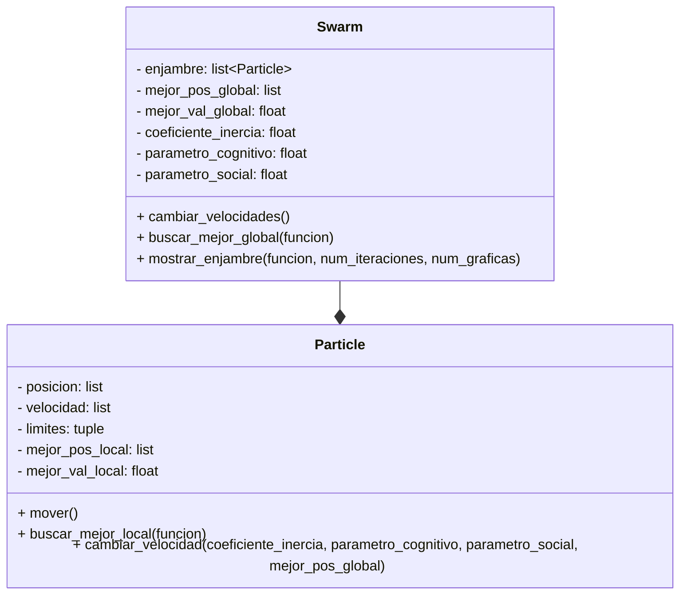

# Proyecto_POO
## Definición de alternativa
Alternativa 3
>Construir una aplicación que emule el algorimo PSO utilizando Python.
## Diagrama de clases

Utilizando las siguientes formulas:

El código implementa el algoritmo de optimización por enjambre de partículas (PSO), que es una técnica inspirada en el comportamiento colectivo de animales como aves o peces para encontrar soluciones óptimas en problemas complejos.

Clases principales:

Particle:
Representa una partícula individual del enjambre.

Atributos:
posicion: posición actual de la partícula en el espacio de búsqueda.
velocidad: velocidad actual de la partícula, que determina cómo se mueve.
mejor_pos_local: mejor posición encontrada por la partícula hasta el momento.
mejor_val_local: valor de la función objetivo en la mejor posición local.
limites: límites del espacio de búsqueda para restringir el movimiento.
Métodos:
mover(): actualiza la posición de la partícula según su velocidad, asegurando que no salga de los límites.
buscar_mejor_local(funcion): evalúa si la posición actual es mejor que la mejor local y la actualiza si es necesario.
cambiar_velocidad(coeficiente_inercia, parametro_cognitivo, parametro_social, mejor_pos_global): ajusta la velocidad de la partícula considerando su experiencia propia (mejor local) y la del grupo (mejor global).

Swarm:
Representa el enjambre completo, es decir, el conjunto de partículas.

Atributos:

enjambre: lista de partículas.

mejor_pos_global: mejor posición encontrada por cualquier partícula.

mejor_val_global: valor de la función objetivo en la mejor posición global.

Parámetros del algoritmo: coeficiente de inercia, cognitivo y social.

Métodos:

cambiar_velocidades(): actualiza la velocidad y posición de todas las partículas.

buscar_mejor_global(funcion): busca la mejor posición global entre todas las partículas.

mostrar_enjambre(funcion, num_iteraciones, num_graficas): ejecuta el proceso de optimización, mostrando gráficamente la posición de las partículas en ciertas iteraciones.

Función objetivo:
En este caso, goldstein_price(x, y): es la función matemática que el enjambre intenta minimizar a manera de prueba :)

Ejecución principal:

Se crea un enjambre de 20 partículas con posiciones aleatorias dentro de los límites [-2, 2].

Se instancia la clase Swarm con estas partículas.

Se ejecuta el método mostrar_enjambre para optimizar la función durante 200 iteraciones y mostrar el progreso en 4 gráficos.

Al final, se imprime el mejor valor encontrado y la posición correspondiente.

Otra manera de ver esto, fuera del código es entender los siguientes 4 pasos:

1) Las partículas y el espacio de búsqueda:
  Imaginemos un tablero donde cada partícula tiene una posición (como coordenadas X y Y) y puede moverse en cualquier dirección, pero no puede salirse de los    bordes del tablero.

La función objetivo:
  Hay una regla matemática (en este caso, la función Goldstein-Price) que, para cada posición del tablero, te dice qué tan “buena” es esa posición. El objetivo es encontrar la posición con el valor más bajo posible (el óptimo).

2) Movimiento y aprendizaje:
  Cada partícula recuerda dos cosas:

  La mejor posición que ha encontrado ella misma.
  La mejor posición que ha encontrado todo el grupo.
  En cada paso, la partícula decide hacia dónde moverse usando:

3) Su velocidad actual (como su impulso).
  Un poco de “curiosidad” por volver a su mejor lugar.
  Un poco de “confianza” en seguir al mejor del grupo.
  Así, cada partícula ajusta su velocidad y se mueve, tratando de mejorar.

4) El enjambre:
  El grupo completo de partículas se llama “enjambre”. El enjambre se mueve durante varias rondas (iteraciones), y en cada ronda todas las partículas actualizan     su posición y velocidad, y se revisa si alguna encontró un lugar mejor.

