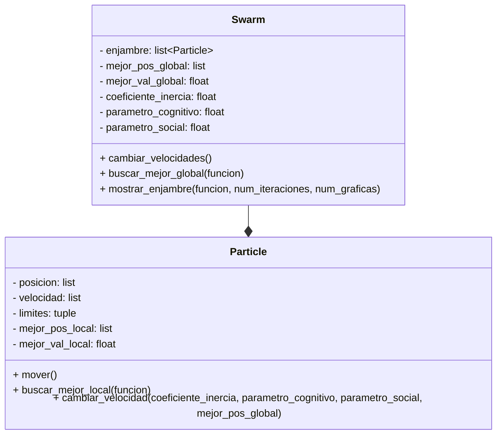

# Proyecto_POO
## Definición de alternativa
Alternativa 3
>Construir una aplicación que emule el algorimo PSO utilizando Python.
## Diagrama de clases

El algoritmo de optimización por enjambre de partículas (PSO),  es una técnica inspirada en el comportamiento colectivo de animales como aves o peces para encontrar soluciones óptimas en problemas complejos.

Primero, se realizaron los siguientes pasos para entender mejor el algoritmo:

1) Las partículas y el espacio de búsqueda:
  Imaginemos un tablero donde cada partícula tiene una posición y puede moverse en cualquier dirección, pero no puede salirse de los bordes del tablero.

La función objetivo:
  Hay una máquina que para cada posición del tablero, te dice qué tan “buena” es esa posición. El objetivo es encontrar la posición con el valor más bajo posible, el óptimo.

2) Movimiento y aprendizaje:
  Cada partícula recuerda dos cosas:

  La mejor posición que ha encontrado ella misma.
  La mejor posición que ha encontrado todo el grupo.
  En cada paso, la partícula decide hacia dónde moverse usando:

3) Su velocidad actual.
  Un poco de “curiosidad” por volver a su mejor lugar.
  Un poco de “confianza” en seguir al mejor del grupo.
  Así, cada partícula ajusta su velocidad y se mueve, tratando de mejorar.

4) El enjambre:
  El grupo completo de partículas se llama “enjambre”. El enjambre se mueve durante varias rondas, y en cada ronda todas las partículas actualizan su posición y velocidad, y se revisa si alguna encontró un lugar mejor.

Ahora, la manera en la que esto sucede en el código es:

---

### 1. Definición de la clase `Particle`

````python
class Particle:
    def __init__(self,posicion: list, funcion, limites: tuple):
        self.posicion = posicion
        self.limites = limites
        distribucion_velocidad = uniform(-abs(limites[0] - limites[1]), abs(limites[0] - limites[1]))
        self.velocidad = [distribucion_velocidad, distribucion_velocidad]
        self.mejor_pos_local = posicion.copy()
        self.mejor_val_local = funcion(*self.posicion)
````

**Explicación:**  
La clase `Particle` representa una partícula del enjambre. Cada partícula tiene una posición, una velocidad, límites de movimiento, y guarda la mejor posición y valor que ha encontrado. Al inicializarse, la partícula recibe una posición aleatoria y calcula su valor inicial usando la función objetivo.

---

### 2. Movimiento y actualización de la partícula

````python
    def mover(self):
        for i in range(len(self.posicion)):
            self.posicion[i] = self.posicion[i] + self.velocidad[i]
            if self.posicion[i] < self.limites[0]:
                self.posicion[i] = self.limites[0]
            elif self.posicion[i] > self.limites[1]:
                self.posicion[i] = self.limites[1]
````

**Explicación:**  
El método `mover` actualiza la posición de la partícula sumando su velocidad actual. Si la nueva posición se sale de los límites permitidos, se ajusta para que permanezca dentro del rango.

---

### 3. Búsqueda de la mejor posición local

````python
    def buscar_mejor_local(self, funcion):
        mejor_val_local_posible = funcion(*self.posicion) 
        if mejor_val_local_posible < self.mejor_val_local:
            self.mejor_val_local = mejor_val_local_posible
            self.mejor_pos_local = self.posicion.copy()
        return self.mejor_pos_local, self.mejor_val_local
````

**Explicación:**  
Este método evalúa si la posición actual de la partícula es mejor que la mejor que ha encontrado hasta ahora. Si es así, actualiza su mejor posición y valor local.

---

### 4. Actualización de la velocidad

````python
    def cambiar_velocidad(self, coeficiente_inercia:float ,parametro_cognitivo: float, parametro_social:float, mejor_pos_global:list):
        nueva_velocidad = []
        for i in range(len(self.velocidad)):
            r1 = uniform(0, 1)
            r2 = uniform(0, 1)
            cognitivo = parametro_cognitivo * r1 * (self.mejor_pos_local[i] - self.posicion[i])
            social = parametro_social * r2 * (mejor_pos_global[i] - self.posicion[i])
            nueva_velocidad.append(coeficiente_inercia * self.velocidad[i] + cognitivo + social)
        self.velocidad = nueva_velocidad
````

**Explicación:**  
El método `cambiar_velocidad` ajusta la velocidad de la partícula considerando tres factores:  
- Inercia (mantener parte de su velocidad anterior),  
- Componente cognitiva (tendencia a regresar a su mejor posición local),  
- Componente social (tendencia a acercarse a la mejor posición global encontrada por el enjambre).

---

### 5. Definición de la clase `Swarm`

````python
class Swarm:
    def __init__(self, enjambre: list[Particle], coeficiente_inercia = 0.7, parametro_cognitivo =2, parametro_social = 2): 
        self.enjambre = enjambre
        self.mejor_pos_global = []
        self.mejor_val_global = float('inf')
        self.coeficiente_inercia = coeficiente_inercia
        self.parametro_cognitivo = parametro_cognitivo
        self.parametro_social = parametro_social
````

**Explicación:**  
La clase `Swarm` representa el enjambre completo, es decir, el conjunto de partículas. Guarda la mejor posición y valor global encontrados, así como los parámetros del algoritmo.

---

### 6. Actualización de velocidades y posiciones en el enjambre

````python
    def cambiar_velocidades(self):
        for particula in self.enjambre:
            particula.cambiar_velocidad(self.coeficiente_inercia, self.parametro_cognitivo, self.parametro_social, self.mejor_pos_global)
            particula.mover()
````

**Explicación:**  
Este método recorre todas las partículas del enjambre, actualiza su velocidad y luego su posición.

---

### 7. Búsqueda de la mejor posición global

````python
    def buscar_mejor_global(self, funcion):
        for particula in self.enjambre:
            if particula.buscar_mejor_local(funcion)[1] < self.mejor_val_global:
                self.mejor_val_global = particula.buscar_mejor_local(funcion)[1]
                self.mejor_pos_global = particula.buscar_mejor_local(funcion)[0].copy()
````

**Explicación:**  
Este método revisa todas las partículas para encontrar la mejor posición global (la de menor valor de la función objetivo) y la actualiza si alguna partícula encuentra una mejor.

---

### 8. Visualización del enjambre durante la optimización

````python
    def mostrar_enjambre(self, funcion, num_iteraciones:int, num_graficas:int):
        for i in range(num_iteraciones + 1):
            self.buscar_mejor_global(funcion)
            if i in [(num_iteraciones//num_graficas)*i for i in range(num_graficas + 1)]:
                for particula in self.enjambre:
                    pyplot.plot(*particula.posicion, "o")
                    pyplot.title(f"Iteracion {i}")
                pyplot.show()
            prueba.cambiar_velocidades()
````

**Explicación:**  
Este método ejecuta el proceso de optimización durante un número determinado de iteraciones y muestra gráficamente la posición de las partículas en ciertos puntos del proceso.

---

### 9. Función objetivo

````python
def goldstein_price(x, y):
    term1 = 1 + (x + y + 1)**2 * (19 - 14*x + 3*x**2 - 14*y + 6*x*y + 3*y**2)
    term2 = 30 + (2*x - 3*y)**2 * (18 - 32*x + 12*x**2 + 48*y - 36*x*y + 27*y**2)
    return term1 * term2
````

**Explicación:**  
Esta es la función matemática que el enjambre intenta minimizar. Es una función estándar de prueba en optimización.

---

### 10. Ejecución principal

````python
if __name__ == "__main__":
    enjambre = []
    for i in range(20):
        limites_prueba = (-2,2)
        posicion_prueba = [uniform(-2.0, 2.0), uniform(-2.0, 2.0)]
        particula = Particle(posicion_prueba, goldstein_price, limites_prueba)
        enjambre.append(particula)

    prueba = Swarm(enjambre)
    prueba.mostrar_enjambre(goldstein_price, 200, 4)
    print(f"Optimizacion: {prueba.mejor_val_global:.3f},\nPosicion:", end=" ")
    print([f"{i:.3f}" for i in prueba.mejor_pos_global])
````

**Explicación:**  
Aquí se crea un enjambre de 20 partículas con posiciones aleatorias, se instancia el enjambre, se ejecuta la optimización y se muestran los resultados finales.

---
