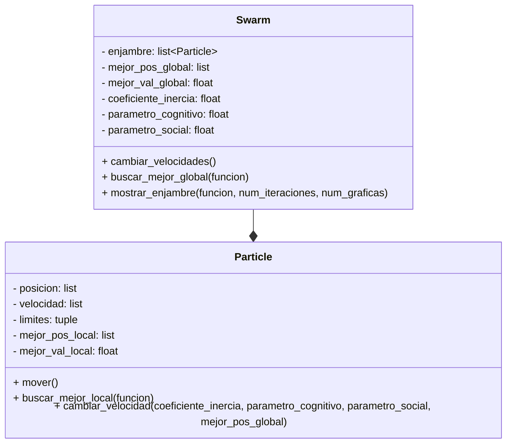

# Proyecto_POO
## Definición de alternativa
Alternativa 3
>Construir una aplicación que emule el algorimo PSO utilizando Python.
### Integrantes

* Sebastian Cespedes
* Brayan Santiago Celi
* Santiago Cely

## Diagrama de clases inicial


## Diagrama de clases con GUI
```mermaid
classDiagram
    class Particle {
        - posicion: list
        - limites: tuple
        - funcion: Callable
        - velocidad: list
        - mejor_pos_local: list
        - mejor_val_local: float
        + __init__(limites, posicion, funcion)
        + mover()
        + buscar_mejor_local() tuple
        + cambiar_velocidad(coeficiente_inercia, parametro_cognitivo, parametro_social, mejor_pos_global)
    }
    
    class Swarm {
        - enjambre: list~Particle~
        - mejor_pos_global: list
        - mejor_val_global: float
        - coeficiente_inercia: float
        - parametro_cognitivo: float
        - parametro_social: float
        + __init__(enjambre, coeficiente_inercia, parametro_cognitivo, parametro_social)
        + cambiar_velocidades()
        + buscar_mejor_global()
    }
    
    class OptimizationGUI {
        - root: tk.Tk
        - swarm: Swarm
        - is_animating: bool
        - pso_function_var: tk.StringVar
        - num_particles_var: tk.IntVar
        - num_iterations_var: tk.IntVar
        - inertia_var: tk.DoubleVar
        - cognitive_var: tk.DoubleVar
        - social_var: tk.DoubleVar
        - viz_type_var: tk.StringVar
        - escala_log_var: tk.BooleanVar
        - pso_function_combo: ttk.Combobox
        - escala_log_check: ttk.Checkbutton
        - viz_type_combo: ttk.Combobox
        - animate_button: ttk.Button
        - results_text: tk.Text
        - pso_figure: Figure
        - pso_canvas: FigureCanvasTkAgg
        + __init__(root)
        + setup_ui()
        + setup_pso_controls(parent)
        + animate_pso()
        + mostrar_enjambre_2d(funcion, num_iteraciones, escala_log)
        + mostrar_enjambre_3d(funcion, num_iteraciones, escala_log)
        + termina_animacion(funcion, Z_plot, X, Y, escala_log, viz_type, label_escala)
        + mostrar_grafica_final(funcion, Z_plot, X, Y, escala_log, viz_type, label_escala)
    }
    
    Swarm --* Particle 
    OptimizationGUI --* Swarm : 


```
El algoritmo de optimización por enjambre de partículas (PSO),  es una técnica inspirada en el comportamiento colectivo de animales como aves o peces para encontrar soluciones óptimas en problemas complejos.

Primero, se realizaron los siguientes pasos para entender mejor el algoritmo:

1) Las partículas y el espacio de búsqueda:

Imaginemos un tablero donde cada partícula tiene una posición y puede moverse en cualquier dirección, pero no puede salirse de los bordes del tablero.

La función objetivo:
  Hay una máquina que para cada posición del tablero, te dice qué tan “buena” es esa posición. El objetivo es encontrar la posición con el valor más bajo posible, el óptimo.

2) Movimiento y aprendizaje:
  Cada partícula recuerda dos cosas:

  La mejor posición que ha encontrado ella misma.
  La mejor posición que ha encontrado todo el grupo.
  En cada paso, la partícula decide hacia dónde moverse usando:

3) Su velocidad actual.
  Un poco de “curiosidad” por volver a su mejor lugar.
  Un poco de “confianza” en seguir al mejor del grupo.
  Así, cada partícula ajusta su velocidad y se mueve, tratando de mejorar.

4) El enjambre:
  El grupo completo de partículas se llama “enjambre”. El enjambre se mueve durante varias rondas, y en cada ronda todas las partículas actualizan su posición y velocidad, y se revisa si alguna encontró un lugar mejor.

Ahora, la manera en la que esto sucede en el código es:

---

### 1. Definición de la clase `Particle`

````python
class Particle:
    def __init__(self,posicion: list, funcion, limites: tuple):
        self.posicion = posicion
        self.limites = limites
        distribucion_velocidad = uniform(-abs(limites[0] - limites[1]), abs(limites[0] - limites[1]))
        self.velocidad = [distribucion_velocidad, distribucion_velocidad]
        self.mejor_pos_local = posicion.copy()
        self.mejor_val_local = funcion(*self.posicion)
````

**Explicación:**  
La clase `Particle` representa una partícula del enjambre. Cada partícula tiene una posición, una velocidad, límites de movimiento, y guarda la mejor posición y valor que ha encontrado. Al inicializarse, la partícula recibe una posición aleatoria y calcula su valor inicial usando la función objetivo.

---

### 2. Movimiento y actualización de la partícula

````python
    def mover(self):
        for i in range(len(self.posicion)):
            self.posicion[i] = self.posicion[i] + self.velocidad[i]
            if self.posicion[i] < self.limites[0]:
                self.posicion[i] = self.limites[0]
            elif self.posicion[i] > self.limites[1]:
                self.posicion[i] = self.limites[1]
````

**Explicación:**  
El método `mover` actualiza la posición de la partícula sumando su velocidad actual. Si la nueva posición se sale de los límites permitidos, se ajusta para que permanezca dentro del rango.

---

### 3. Búsqueda de la mejor posición local

````python
    def buscar_mejor_local(self, funcion):
        mejor_val_local_posible = funcion(*self.posicion) 
        if mejor_val_local_posible < self.mejor_val_local:
            self.mejor_val_local = mejor_val_local_posible
            self.mejor_pos_local = self.posicion.copy()
        return self.mejor_pos_local, self.mejor_val_local
````

**Explicación:**  
Este método evalúa si la posición actual de la partícula es mejor que la mejor que ha encontrado hasta ahora. Si es así, actualiza su mejor posición y valor local.

---

### 4. Actualización de la velocidad

````python
    def cambiar_velocidad(self, coeficiente_inercia:float ,parametro_cognitivo: float, parametro_social:float, mejor_pos_global:list):
        nueva_velocidad = []
        for i in range(len(self.velocidad)):
            r1 = uniform(0, 1)
            r2 = uniform(0, 1)
            cognitivo = parametro_cognitivo * r1 * (self.mejor_pos_local[i] - self.posicion[i])
            social = parametro_social * r2 * (mejor_pos_global[i] - self.posicion[i])
            nueva_velocidad.append(coeficiente_inercia * self.velocidad[i] + cognitivo + social)
        self.velocidad = nueva_velocidad
````

**Explicación:**  
El método `cambiar_velocidad` ajusta la velocidad de la partícula considerando tres factores:  
- Inercia (mantener parte de su velocidad anterior),  
- Componente cognitiva (tendencia a regresar a su mejor posición local),  
- Componente social (tendencia a acercarse a la mejor posición global encontrada por el enjambre).

---

### 5. Definición de la clase `Swarm`

````python
class Swarm:
    def __init__(self, enjambre: list[Particle], coeficiente_inercia = 0.7, parametro_cognitivo =2, parametro_social = 2): 
        self.enjambre = enjambre
        self.mejor_pos_global = []
        self.mejor_val_global = float('inf')
        self.coeficiente_inercia = coeficiente_inercia
        self.parametro_cognitivo = parametro_cognitivo
        self.parametro_social = parametro_social
````

**Explicación:**  
La clase `Swarm` representa el enjambre completo, es decir, el conjunto de partículas. Guarda la mejor posición y valor global encontrados, así como los parámetros del algoritmo.

---

### 6. Actualización de velocidades y posiciones en el enjambre

````python
    def cambiar_velocidades(self):
        for particula in self.enjambre:
            particula.cambiar_velocidad(self.coeficiente_inercia, self.parametro_cognitivo, self.parametro_social, self.mejor_pos_global)
            particula.mover()
````

**Explicación:**  
Este método recorre todas las partículas del enjambre, actualiza su velocidad y luego su posición.

---

### 7. Búsqueda de la mejor posición global

````python
    def buscar_mejor_global(self):
        for particula in self.enjambre:
            if particula.buscar_mejor_local()[1] < self.mejor_val_global:
                self.mejor_val_global = particula.buscar_mejor_local()[1]
                self.mejor_pos_global = particula.buscar_mejor_local()[0].copy()
````

**Explicación:**  
Este método revisa todas las partículas para encontrar la mejor posición global (la de menor valor de la función objetivo) y la actualiza si alguna partícula encuentra una mejor. Ahora no necesita la función como parámetro ya que cada partícula ya tiene su función objetivo.

---

### 8. Interfaz Gráfica para Optimización PSO

````python
class OptimizationGUI:
    def __init__(self, root):
        self.root = root
        self.root.title('PSO Animado - Prototipo')
        self.root.geometry('1000x800')
        
        # Variables de estado
        self.swarm = None
        self.is_animating = False
        
        # Variables de GUI - PSO
        self.pso_function_var = tk.StringVar(value="Goldstein-Price")
        self.num_particles_var = tk.IntVar(value=20)
        self.num_iterations_var = tk.IntVar(value=100)
        self.inertia_var = tk.DoubleVar(value=0.7)
        self.cognitive_var = tk.DoubleVar(value=2.0)
        self.social_var = tk.DoubleVar(value=2.0)
        self.viz_type_var = tk.StringVar(value="2D")
        self.escala_log_var = tk.BooleanVar(value=True)
````

**Explicación:**  
La clase `OptimizationGUI` proporciona una interfaz gráfica completa para controlar y visualizar el algoritmo PSO. Incluye variables para configurar todos los parámetros del algoritmo y controlar el estado de la animación.

---

### 9. Configuración de controles PSO

````python
    def setup_pso_controls(self, parent):
        # Selector de función
        ttk.Label(parent, text="Función:").grid(row=0, column=0)
        self.pso_function_combo = ttk.Combobox(parent, textvariable=self.pso_function_var, 
                                              values=nombres_funciones(), state="readonly")
        
        # Parámetros básicos
        ttk.Label(parent, text="Partículas:").grid(row=1, column=0)
        ttk.Spinbox(parent, from_=5, to=100, textvariable=self.num_particles_var, width=8)
        
        # Parámetros PSO avanzados
        ttk.Label(parent, text="Inercia:").grid(row=2, column=0)
        ttk.Spinbox(parent, from_=0.1, to=2.0, increment=0.1, textvariable=self.inertia_var)
        
        ttk.Label(parent, text="Cognitivo:").grid(row=2, column=2)
        ttk.Spinbox(parent, from_=0.5, to=5.0, increment=0.1, textvariable=self.cognitive_var)
        
        ttk.Label(parent, text="Social:").grid(row=2, column=4)
        ttk.Spinbox(parent, from_=0.5, to=5.0, increment=0.1, textvariable=self.social_var)
````

**Explicación:**  
Este método crea todos los controles de la interfaz permitiendo al usuario configurar la función objetivo, número de partículas, iteraciones y los tres parámetros fundamentales del PSO: inercia, cognitivo y social.

---

### 10. Animación PSO con visualización 2D

````python
    def mostrar_enjambre_2d(self, funcion, num_iteraciones, escala_log=True):
        # Crear la malla para la función de fondo
        x = linspace(self.swarm.enjambre[0].limites[0], self.swarm.enjambre[0].limites[1], 100)
        y = linspace(self.swarm.enjambre[0].limites[0], self.swarm.enjambre[0].limites[1], 100)
        X, Y = meshgrid(x, y)
        Z = funcion(X, Y)   
        
        # Decidir escala (logarítmica o normal)
        if escala_log:
            Z_plot = log10(Z)
            label_escala = "Escala logarítmica"
        else:
            Z_plot = Z
            label_escala = "Escala normal"
        
        # Bucle de animación
        for i in range(num_iteraciones + 1):
            if not self.is_animating:
                break
                
            self.swarm.buscar_mejor_global()
            
            if i % 3 == 0:  # Actualizar cada 3 iteraciones
                self.pso_figure.clear()
                ax = self.pso_figure.add_subplot(111)
                
                # Dibujar el fondo con contornos
                im = ax.imshow(Z_plot, extent=[...], origin='lower', cmap='viridis')
                ax.contour(X, Y, Z_plot, levels=15, colors='white', alpha=0.7)
                
                # Dibujar partículas
                for particula in self.swarm.enjambre:
                    ax.plot(*particula.posicion, "ro", markersize=6)
                
                ax.set_title(f"Iteración {i} - Mejor: {self.swarm.mejor_val_global:.6f}")
                self.pso_canvas.draw()
                self.root.update()
                
            self.swarm.cambiar_velocidades()
````

**Explicación:**  
Este método ejecuta la animación 2D del algoritmo PSO. Crea una visualización en tiempo real donde se puede observar el movimiento de las partículas sobre el paisaje de la función objetivo, actualizando la gráfica cada 3 iteraciones para mantener fluidez.

---

### 11. Animación PSO con visualización 3D

````python
    def mostrar_enjambre_3d(self, funcion, num_iteraciones, escala_log=True):
        # Crear malla 3D
        x = linspace(self.swarm.enjambre[0].limites[0], self.swarm.enjambre[0].limites[1], 100)
        y = linspace(self.swarm.enjambre[0].limites[0], self.swarm.enjambre[0].limites[1], 100)
        X, Y = meshgrid(x, y)
        Z = funcion(X, Y)   
        
        # Determinar escala de visualización
        if escala_log and (Z > 0).all():
            Z_plot = log10(Z)
            titulo_base = "Escala logarítmica"
        else:
            Z_plot = Z
            titulo_base = "Escala normal"
        
        # Bucle de animación 3D
        for i in range(num_iteraciones + 1):
            if not self.is_animating:
                break
                
            self.swarm.buscar_mejor_global()
            
            if i % 5 == 0:  # Actualizar cada 5 iteraciones para 3D
                self.pso_figure.clear()
                ax = self.pso_figure.add_subplot(111, projection='3d')
                
                # Superficie 3D
                suprf = ax.plot_surface(X, Y, Z_plot, cmap="viridis", alpha=0.7)
                
                # Partículas en 3D
                for particula in self.swarm.enjambre:
                    parte_x, parte_y = particula.posicion
                    parte_z = log10(funcion(parte_x, parte_y)) if escala_log else funcion(parte_x, parte_y)
                    ax.scatter([parte_x], [parte_y], [parte_z], color='red', s=80)
                
                ax.set_title(f'{titulo_base} - Iteración {i}\nMejor: {self.swarm.mejor_val_global:.6f}')
                self.pso_canvas.draw()
                self.root.update()
                
            self.swarm.cambiar_velocidades()
````

**Explicación:**  
La visualización 3D muestra la superficie completa de la función objetivo con las partículas moviéndose sobre ella. Se actualiza cada 5 iteraciones para mantener un rendimiento adecuado, permitiendo observar cómo las partículas navegan por el espacio tridimensional.

---

### 12. Control de animación

````python
    def animate_pso(self):
        if self.is_animating:
            self.is_animating = False
            self.animate_button.config(text="Iniciar Animación PSO")
            return
            
        self.is_animating = True
        self.animate_button.config(text="Detener Animación")
        
        # Obtener parámetros de la GUI
        function_name = self.pso_function_var.get()
        funcion = get_funcion(function_name)
        num_particles = self.num_particles_var.get()
        num_iterations = self.num_iterations_var.get()
        limites = get_limites(function_name)
        
        # Parámetros PSO personalizados
        inertia = self.inertia_var.get()
        cognitivo = self.cognitive_var.get()
        social = self.social_var.get()
        
        # Crear enjambre con parámetros configurados
        enjambre = crear_enjambre(num_particles, limites, funcion)
        self.swarm = Swarm(enjambre, inertia, cognitivo, social)
        
        # Iniciar visualización según tipo seleccionado
        viz_type = self.viz_type_var.get()
        if viz_type == "2D":
            self.mostrar_enjambre_2d(funcion, num_iterations, self.escala_log_var.get())
        else:
            self.mostrar_enjambre_3d(funcion, num_iterations, self.escala_log_var.get())
````

**Explicación:**  
Este método maneja el inicio y detención de la animación. Extrae todos los parámetros configurados por el usuario desde la interfaz gráfica, crea un nuevo enjambre con esos parámetros y lanza la visualización correspondiente (2D o 3D).

---

### 13. Finalización de animación

````python
    def termina_animacion(self, funcion, Z_plot, X, Y, escala_log, viz_type, label_escala):
        self.is_animating = False
        self.animate_button.config(text="Iniciar Animación PSO")
        
        function_name = self.pso_function_var.get()
        
        # Mostrar resultados finales
        if self.swarm.mejor_pos_global:
            resultado = f"Función: {function_name}\n"
            resultado += f"Mejor valor: {self.swarm.mejor_val_global:.6f}\n"
            resultado += f"Mejor posición: [{self.swarm.mejor_pos_global[0]:.6f}, {self.swarm.mejor_pos_global[1]:.6f}]\n"
            resultado += f"Visualización: {viz_type}"
            
            self.results_text.delete(1.0, tk.END)
            self.results_text.insert(1.0, resultado)
            
            # Mostrar gráfico final
            self.mostrar_grafica_final(funcion, Z_plot, X, Y, escala_log, viz_type, label_escala)
````

**Explicación:**  
Este método se ejecuta cuando termina la animación. Detiene la animación, actualiza el botón y muestra los resultados finales en el área de texto, incluyendo la mejor posición y valor encontrados.

---

### 14. Creación del enjambre

````python
def crear_enjambre(num_particulas: int, limites: tuple, funcion: Callable):
    return [Particle(
                limites, 
                [uniform(limites[0], limites[1]), 
                 uniform(limites[0], limites[1])], funcion) 
            for i in range(num_particulas)]
````

**Explicación:**  
Esta función utilitaria crea un enjambre de partículas con posiciones iniciales aleatorias dentro de los límites especificados. Cada partícula se inicializa con la función objetivo correspondiente.

---

### 15. Ejecución principal con GUI

````python
from PSO import OptimizationGUI, crear_root
 
if __name__ == "__main__":
    # Se inicializa la raíz de la GUI y se corre la aplicación
    root = crear_root()
    app = OptimizationGUI(root)
    root.mainloop()
````

**Explicación:**  
El programa se ejecuta creando una ventana principal de tkinter y instanciando la clase OptimizationGUI. Esto proporciona una interfaz completa donde el usuario puede:

- Seleccionar diferentes funciones de optimización
- Configurar parámetros PSO (inercia, cognitivo, social)
- Elegir número de partículas e iteraciones
- Alternar entre visualización 2D y 3D
- Controlar la escala logarítmica
- Iniciar/detener la animación en tiempo real
- Ver los resultados finales de optimización

La GUI integra toda la funcionalidad del algoritmo PSO en una interfaz intuitiva y visualmente atractiva.

---

## Requisitos de instalacion
Se utilizan las librerias externas matplotlib.
consultar: https://matplotlib.org/stable/install/index.html 
