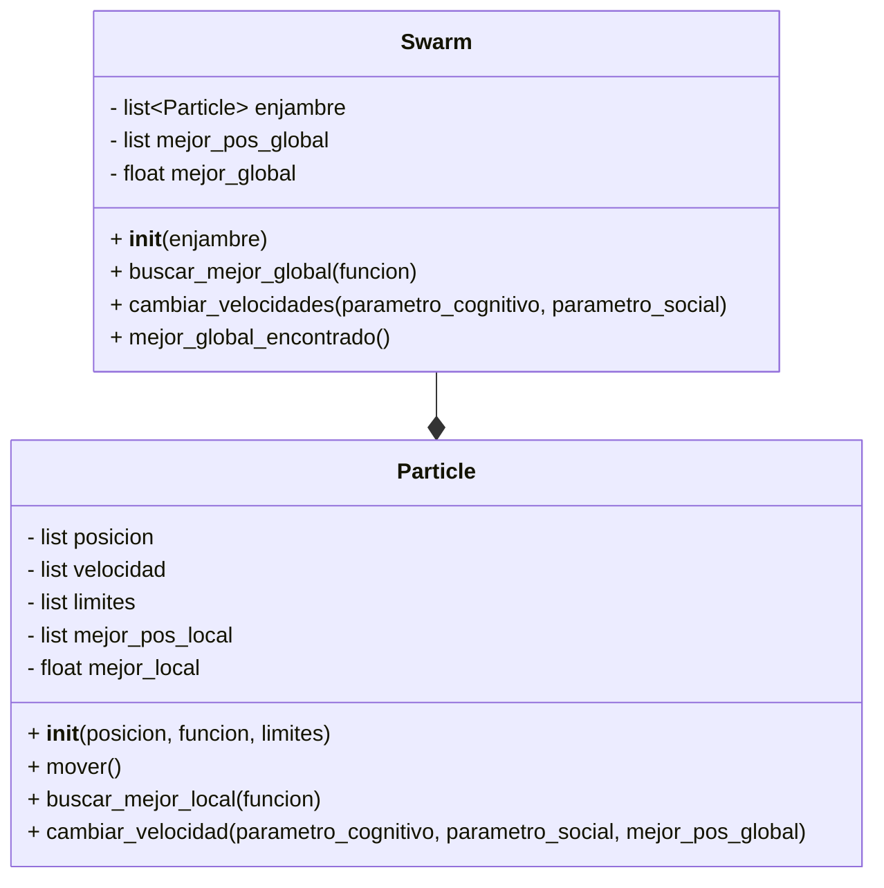

# Proyecto_POO
## Definición de alternativa
Alternativa 3
>Construir una aplicación que emule el algorimo PSO utilizando Python.
## Diagrama de clases

Utilizando las siguientes formulas:

Se definieron dos clases, 
